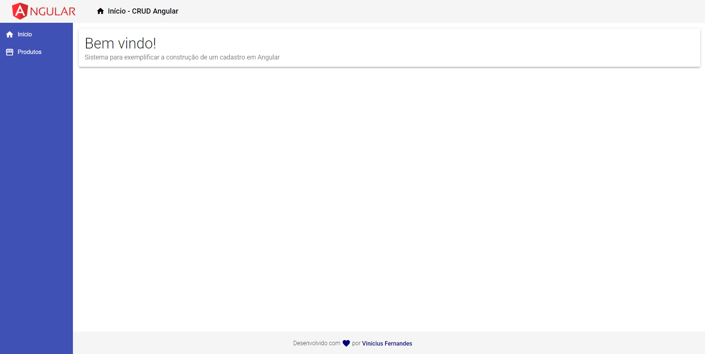
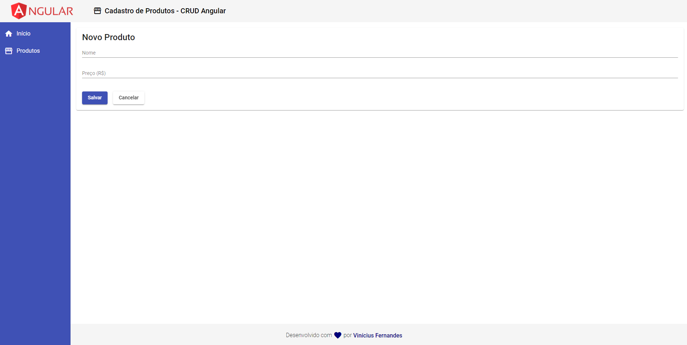
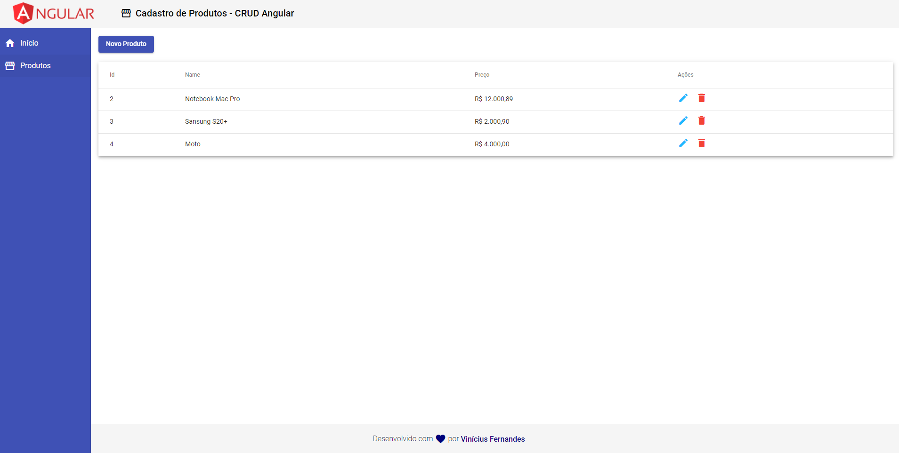
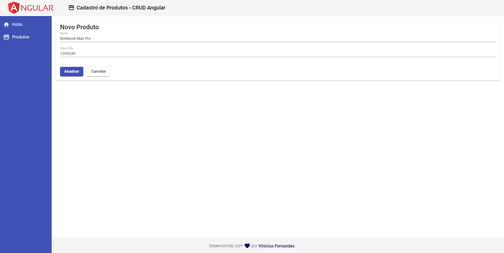
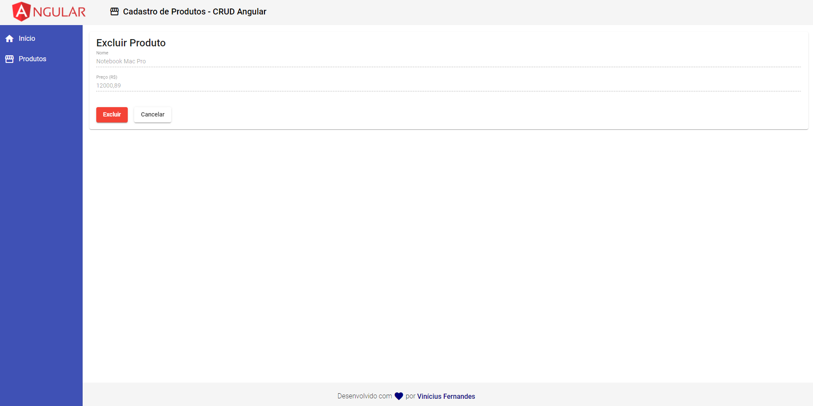
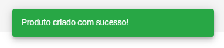
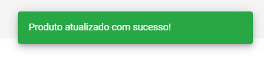
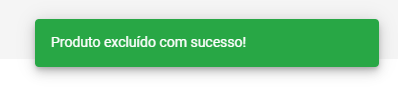
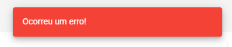

<h1 align="center">
    
</h1>

## 💻 Project

Projects for study Angular - First Steps

## :rocket: Technologies

This project was developed with the following technologies:

- [Angular](https://angular.io/)

## :information_source: How To Use

To clone and run this application, you'll need [Git](https://git-scm.com), [Node.js][nodejs] + [Yarn][yarn] installed on your computer.

```bash
# Clone this repository
$ git clone https://github.com/ViniCleFer/angularStudy.git
```

### CRUD Angular

#### Screens

<p align="center">
  
  
  
  
  
  <div width="300px" align="center">
    
    
    
    
  </div>
</p>


[nodejs]: https://nodejs.org/
[yarn]: https://yarnpkg.com/
[vc]: https://code.visualstudio.com/
[vceditconfig]: https://marketplace.visualstudio.com/items?itemName=EditorConfig.EditorConfig
[vceslint]: https://marketplace.visualstudio.com/items?itemName=dbaeumer.vscode-eslint
[prettier]: https://marketplace.visualstudio.com/items?itemName=esbenp.prettier-vscode
