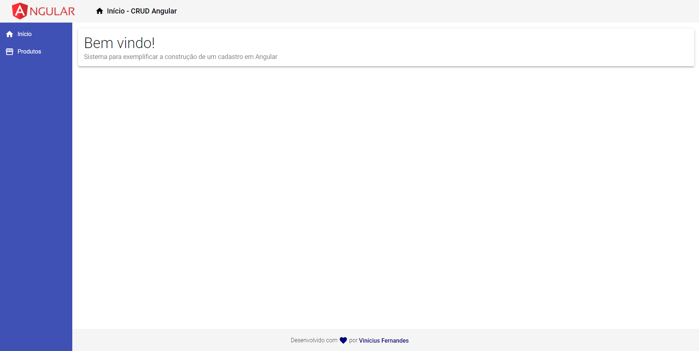
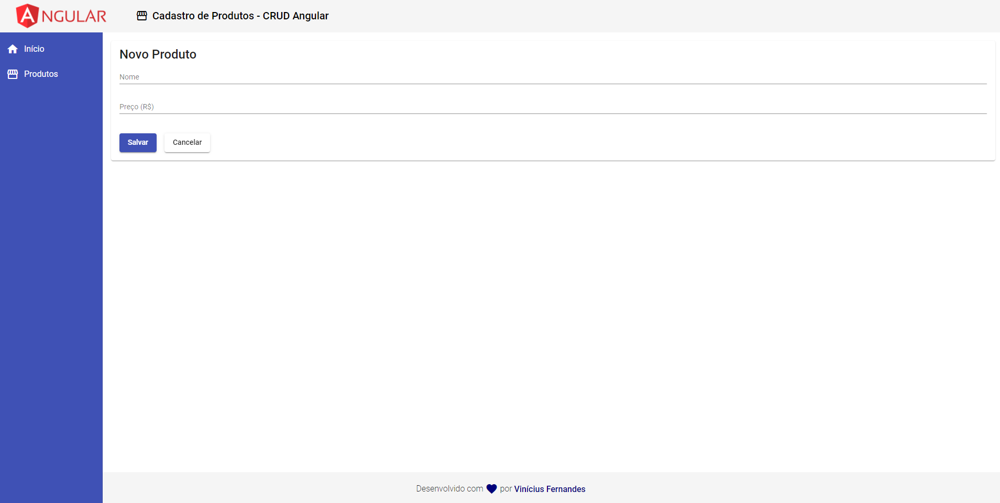
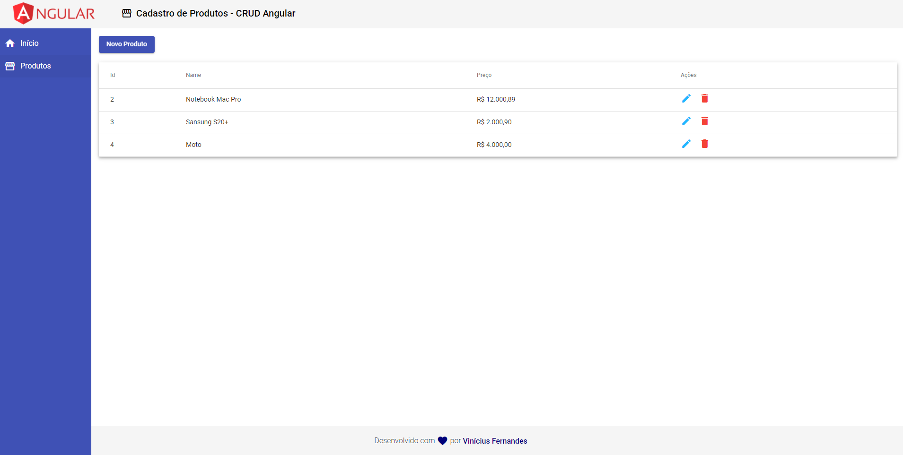
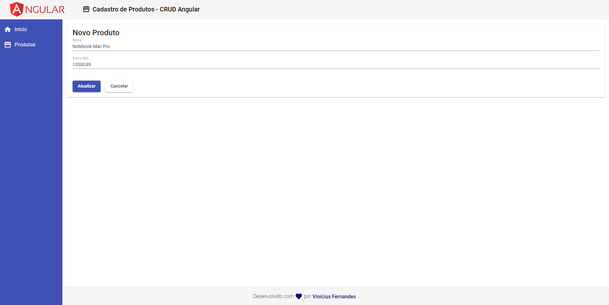
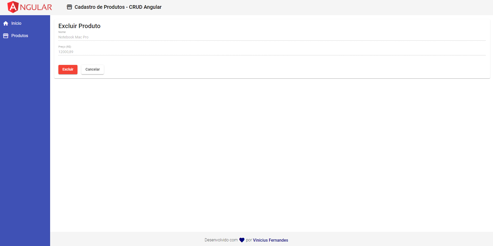
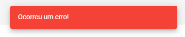

<h1 align="center">
    
</h1>

## 💻 Project

CRUD with Angluar.

## :rocket: Technologies

This project was developed with the following technologies:

- [Angular](https://angular.io/)

## :information_source: How To Use

To clone and run this application, you'll need [Git](https://git-scm.com), [Node.js][nodejs] + [Yarn][yarn] installed on your computer.

### Screens

<p align="center">
  
  
  
  
  
  <div width="500px" align="center">
    
    
    
    
  </div>
</p>

### Install App Backend

```bash
# Clone this repository
$ git clone https://github.com/ViniCleFer/angularStudy.git

# access the project
$ cd crudAngular

# go to backend directory
$ cd backend

# Install dependencies
$ yarn install || npm install

# Run the backend
$ yarn start || npm run start
```

### Install App Frontend

```bash
# Clone this repository
$ git clone https://github.com/ViniCleFer/angularStudy.git

# access the project
$ cd crudAngular

# go to frontend directory
$ cd backend

# Install dependencies
$ yarn install || npm install

# Run the frontend
$ yarn start || npm run start
```

[nodejs]: https://nodejs.org/
[yarn]: https://yarnpkg.com/
[vc]: https://code.visualstudio.com/
[vceditconfig]: https://marketplace.visualstudio.com/items?itemName=EditorConfig.EditorConfig
[vceslint]: https://marketplace.visualstudio.com/items?itemName=dbaeumer.vscode-eslint
[prettier]: https://marketplace.visualstudio.com/items?itemName=esbenp.prettier-vscode
